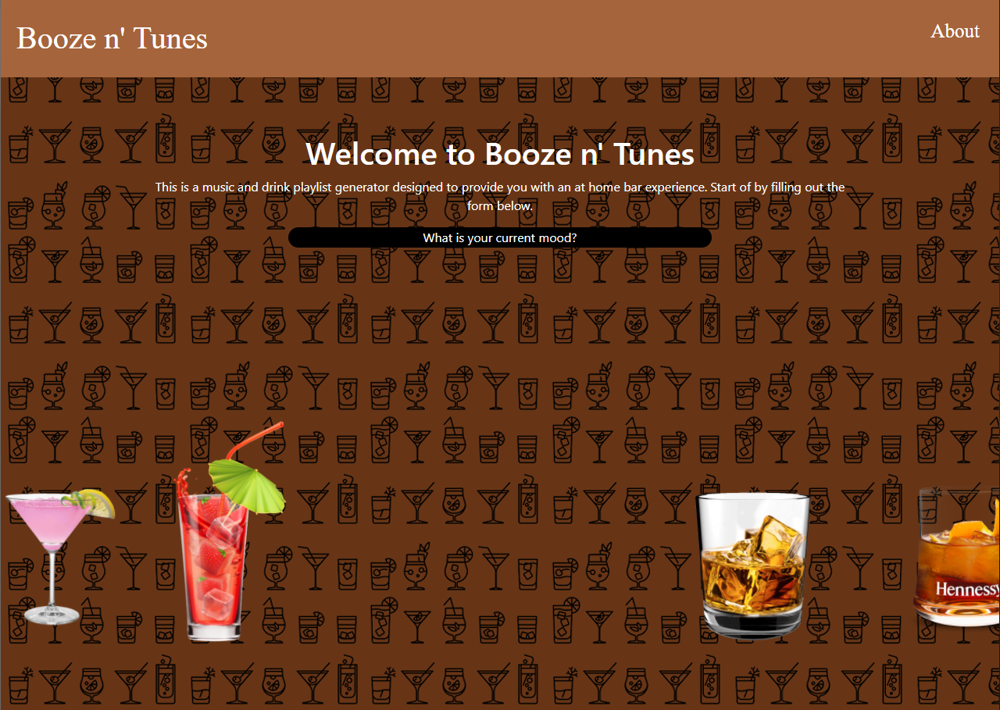

# cocktail-tunez

Booze 'n Tunes is an app that recreates the bar experience. Users click from the dropdown menu and select a mood. They are then displayed with a cocktail drink recipe, associated playlist, an associated gif, and a fun little message. The User is then also able to change the playlist or drink within that mood. They can also change the mood itself.

## Screenshot

## Link to deployed website

https://spencerv86.github.io/booze-n-tunes/

## Contributors and their github profiles

[Selena](https://github.com/ssingle7) Singleton, [Spencer](https://github.com/spencerv86) Vaughan, [Ikenna](https://github.com/ItsJustIkenna) Nwagbara, and [William](https://github.com/tr8b5) Miller