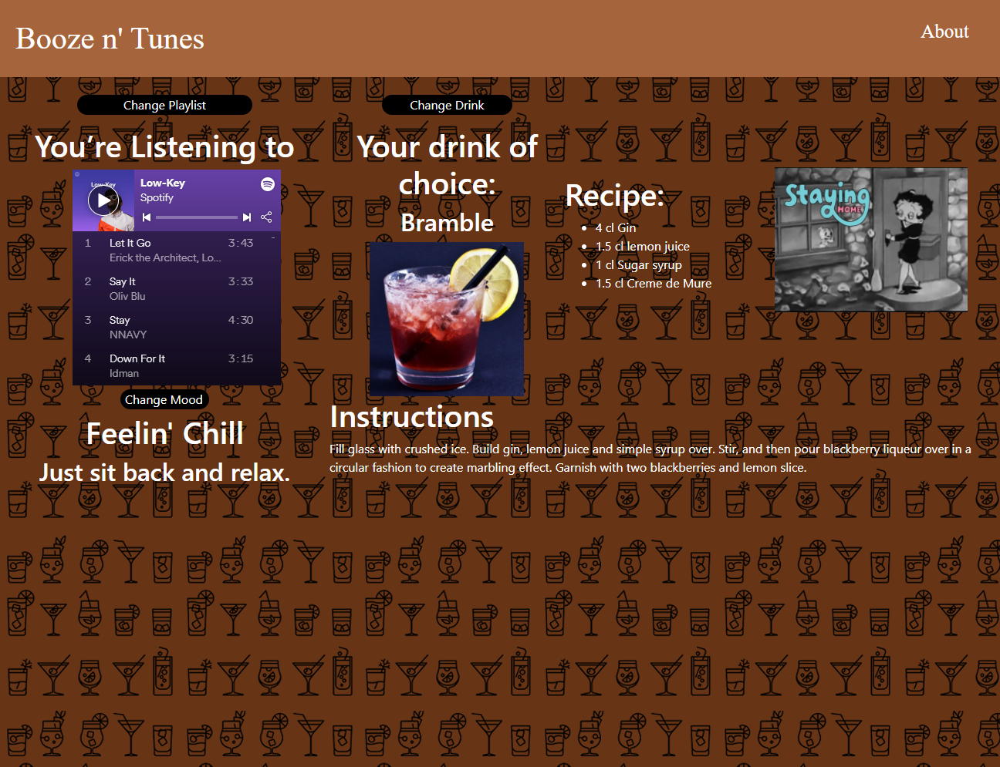

# Booze 'n Tunes

## Description

[Booze 'n Tunes](https://spencerv86.github.io/booze-n-tunes/) is an app that recreates the bar experience. Users click from the dropdown menu and select a mood. They are then displayed with a cocktail drink recipe, associated playlist, an associated gif, and a fun little message. The User is then also able to change the playlist or drink within that mood. They can also change the mood itself.

## Usage
To use our application, simply click the dropdown menu on the homepage and choose from one of the listed moods. You'll have the option of 'Happy', 'Sad', 'Classy', 'Excited', or 'Chill'.

Once a mood is chosen, the site will redirect you to our results page. On this page you will find a playlist and cocktail recipe randomly generated from our curated arrays for each mood.

## Link to deployed website and Repository

https://spencerv86.github.io/booze-n-tunes/

Github repository: https://www.github.com/spencerv86/booze-n-tunes

## Contributors and their github profiles

[Selena Singleton](https://github.com/ssingle7), [Spencer Vaughan](https://github.com/spencerv86), [Ikenna Nwagbara](https://github.com/ItsJustIkenna), and [William Miller](https://github.com/tr8b5).

Click our names to see our individual github profiles!

## License

MIT License

Copyright (c) [2021] [Spencer Vaughan]

Permission is hereby granted, free of charge, to any person obtaining a copy
of this software and associated documentation files (the "Software"), to deal
in the Software without restriction, including without limitation the rights
to use, copy, modify, merge, publish, distribute, sublicense, and/or sell
copies of the Software, and to permit persons to whom the Software is
furnished to do so, subject to the following conditions:

The above copyright notice and this permission notice shall be included in all
copies or substantial portions of the Software.

THE SOFTWARE IS PROVIDED "AS IS", WITHOUT WARRANTY OF ANY KIND, EXPRESS OR
IMPLIED, INCLUDING BUT NOT LIMITED TO THE WARRANTIES OF MERCHANTABILITY,
FITNESS FOR A PARTICULAR PURPOSE AND NONINFRINGEMENT. IN NO EVENT SHALL THE
AUTHORS OR COPYRIGHT HOLDERS BE LIABLE FOR ANY CLAIM, DAMAGES OR OTHER
LIABILITY, WHETHER IN AN ACTION OF CONTRACT, TORT OR OTHERWISE, ARISING FROM,
OUT OF OR IN CONNECTION WITH THE SOFTWARE OR THE USE OR OTHER DEALINGS IN THE
SOFTWARE.